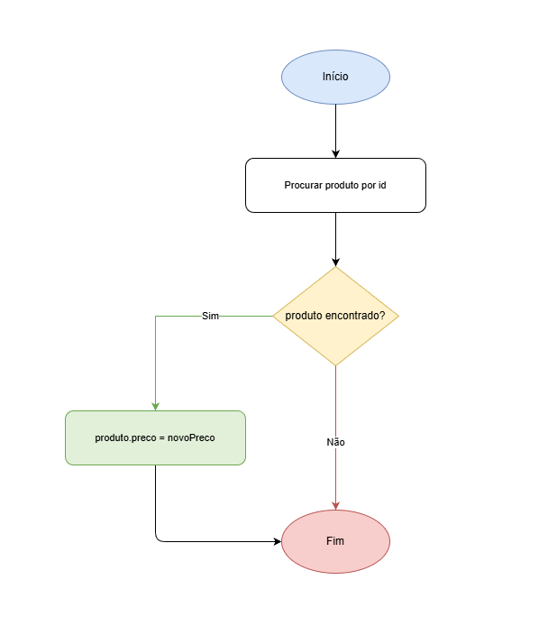

# TechStore (Gestão de Inventário)

## Descrição do Projeto

O **TechStore** é um sistema completo de gestão de inventário desenvolvido para uma loja de tecnologia. A aplicação permite o controlo eficiente do armazém, rastreamento de vendas e análise de dados de produtos.

### Funcionalidades Principais

O sistema é capaz de armazenar e gerir duas fontes de informação críticas:

- **Inventário**: Informação detalhada sobre todos os produtos disponíveis (ID, nome, preço, stock e categoria)
- **Histórico de Vendas**: Registo completo de cada transação realizada na loja

### Operações Suportadas

A aplicação implementa as seguintes operações essenciais:

1. **Atualizar Preço** — Alterar o preço de um produto específico através do seu identificador
2. **Registar Venda** — Diminuir o stock automaticamente e registar a transação no histórico de vendas
3. **Valor Total do Inventário** — Calcular o investimento financeiro total em stock
4. **Limpeza de Stock** — Remover automaticamente produtos com zero unidades
5. **Filtro de Categoria** — Listar apenas os produtos de uma categoria específica
6. **Produto Premium** — Identificar e devolver os dados do produto mais caro
7. **Repor Stock** — Adicionar unidades a um produto já existente
8. **Operações Criativas** — Três funcionalidades adicionais implementadas (Black Friday 40% desconto, carrinho de compras e recibo formatado)

## Fluxograma

### Função `alterarPreco(id, novoPreco)`

Este diagrama ilustra o fluxo de execução da função `alterarPreco`, responsável por alterar o preço de um produto específico. O processo inicia com a procura do produto pelo seu identificador; se encontrado, o preço é atualizado; caso contrário, a função termina sem alterações.

### Função `valorTotalDeInventario()`

Este diagrama representa o fluxo de cálculo do valor total investido em stock. A função inicializa um acumulador, itera sobre todos os produtos do inventário, calcula o valor de cada um (stock × preço) e acumula na soma total, retornando finalmente o investimento total em EUR.

## Autores

- [Abel Pinto - @AbelPinto229](https://github.com/AbelPinto229)
- [Danilson Sanches - @upskill217](https://github.com/upskill217)