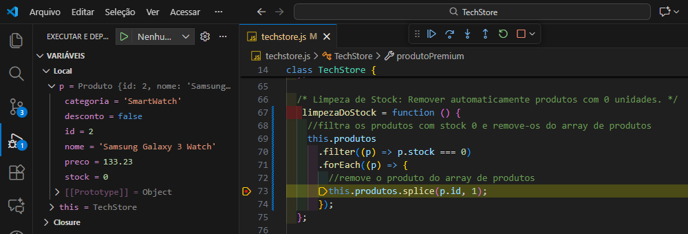
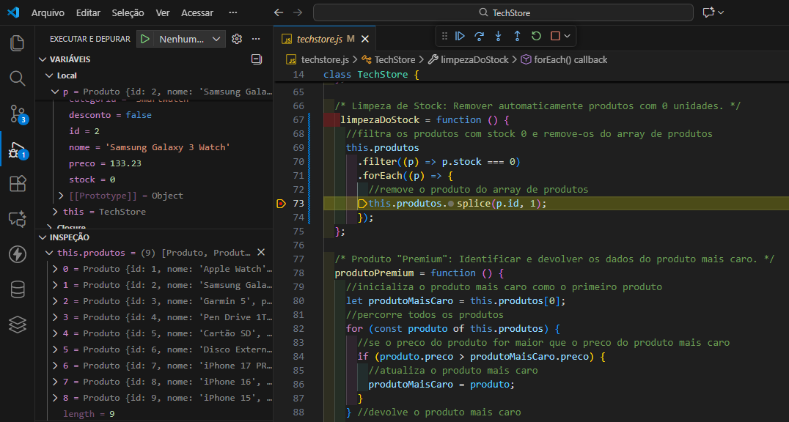
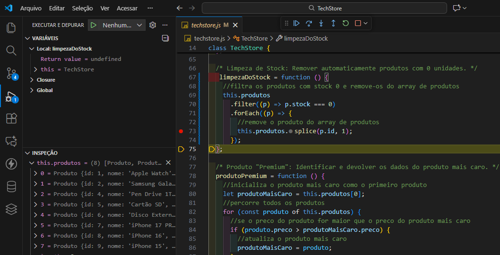
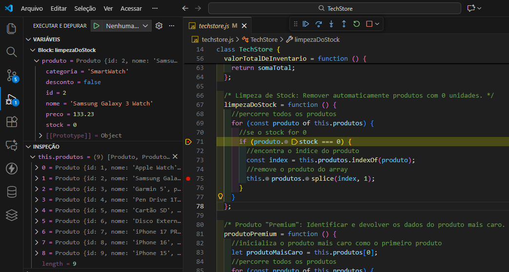
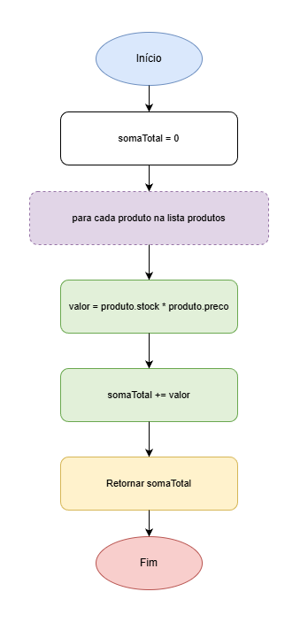

# TechStore (Gestão de Inventário)

## Descrição do Projeto

O **TechStore** é um sistema completo de gestão de inventário desenvolvido para uma loja de tecnologia. A aplicação permite o controlo eficiente do armazém, rastreamento de vendas e análise de dados de produtos.

### Funcionalidades Principais

O sistema é capaz de armazenar e gerir duas fontes de informação críticas:

- **Inventário**: Informação detalhada sobre todos os produtos disponíveis (ID, nome, preço, stock e categoria)
- **Histórico de Vendas**: Registo completo de cada transação realizada na loja

### Operações Suportadas

A aplicação implementa as seguintes operações essenciais:

1. **Atualizar Preço** — Alterar o preço de um produto específico através do seu identificador
2. **Registar Venda** — Diminuir o stock automaticamente e registar a transação no histórico de vendas
3. **Valor Total do Inventário** — Calcular o investimento financeiro total em stock
4. **Limpeza de Stock** — Remover automaticamente produtos com zero unidades
5. **Filtro de Categoria** — Listar apenas os produtos de uma categoria específica
6. **Produto Premium** — Identificar e devolver os dados do produto mais caro
7. **Repor Stock** — Adicionar unidades a um produto já existente
8. **Operações Criativas** — Três funcionalidades adicionais implementadas (Black Friday 40% desconto, Listar Produtos em Desconto  e Relatorio de vendas do dia)


## Como Executar o Projeto

### Pré-requisitos e ferramentas
- Git 
- Github
- Node.js
- Visual Studio Code

### Passos de Instalação e execução
1. Clone o repositório:
```bash
git clone https://github.com/upskill217/TechStore.git
cd TechStore
```

2. Execute o projeto:
```bash
node techstore.js
```

## Estruturas de Dados Escolhidas

### Classe `Produto`

A classe `Produto` encapsula os atributos essenciais de cada item do inventário:

```javascript
class Produto {
  constructor(id, nome, preco, stock, categoria) {
    this.id;        // Identificador único
    this.nome;      // Designação do produto
    this.preco;     // Valor em EUR
    this.stock;     // Quantidade disponível
    this.categoria; // Classificação (ex: "SmartWatch", "Telemovéis")
  }
}
```

**Justificação**: Esta estrutura é adequada porque:
- **Encapsulamento**: Agrupa dados correlacionados em uma única entidade.
- **Identificação única**: O campo `id` permite operações de busca, atualização e eliminação eficientes.
- **Categorização**: Permite filtros e análises por categoria.
- **Flexibilidade**: Fácil expansão com novos atributos (ex: desconto, rating, fornecedor).

### Classe `TechStore`

A classe `TechStore` representa o objecto que gere toda a loja — inventário e histórico de vendas — e expõe as operações principais (CRUD e relatórios):

```javascript
class TechStore {
  constructor(nome) {
    this.nome = nome;              // Nome da loja
    this.produtos = [];            // Array de instâncias Produto
    this.historicoVendas = [];     // Array de registos de vendas
  }
}
```

**Justificação**: A classe `TechStore` é apropriada porque:
- **Agregação**: Centraliza o estado e as operações relacionadas à loja num único objecto, facilitando testes e reutilização.
- **Coesão**: Métodos do negócio (vendas, inventário, relatórios) ficam agrupados, melhorando a manutenção.
- **Estado controlado**: Possibilita validação centralizada (por exemplo, verificar stock antes de vender) e logging.
- **Facilidade de evolução**: Permite migrar para backend persistente (BD) mantendo a mesma API de métodos.

### Array de Produtos e Histórico de Vendas

**Utilizamos arrays nativos do JavaScript para armazenar:**
- `this.produtos = []` — Inventário dinâmico
- `this.historicoVendas = []` — Registo de transações

**Justificação:**
- **Acesso indexado**: Operações de busca com `.find()` e `.filter()` são eficientes.
- **Manipulação fácil**: Métodos nativos como `.push()`, `.splice()` facilitam operações CRUD.
- **Simplicidade**: Para um projeto educacional, arrays são suficientes e intuitivos.

## Operações Criativas Implementadas

### 1. Black Friday — Desconto Automático de 40% em Tudo

**Descrição**: Aplicar automaticamente desconto de 40% em todos os produtos da loja, marcando-os como em promoção.

```javascript
descontoBlackFriday = function () {
  //aplica 40% de desconto a todos os produtos
  for (let produto of this.produtos) {
    //60% do preço original
    const novoPreco = produto.preco * 0.6;
    //marca o produto como em desconto
    produto.desconto = true;
    //atualiza o preço do produto
    this.alterarPreco(produto.id, novoPreco);
  }
};
```

**Justificação da adequação**:
- **Valor comercial**: Black Friday é uma operação crítica em e-commerce, aumentando volume de vendas.
- **Automação**: Elimina erros manuais ao aplicar descontos em massa.
- **Rastreabilidade**: A flag `desconto` permite identificar quais produtos estão em promoção.
- **Reutilização**: Aproveita a função `alterarPreco()` já existente.
- **Impacto real**: Afeta decisões de preço e análises de rentabilidade.

### 2. Listar Produtos em Desconto

**Descrição**: Filtrar e devolver todos os produtos que estão com desconto ativo.

```javascript
listarProdutosEmDesconto = function () {
  return this.produtos.filter((p) => p.desconto);
};
```

**Justificação da adequação**:
- **Complementaridade**: Funciona em conjunto com `descontoBlackFriday()`, permitindo consultas pós-promoção.
- **Performance**: Usa `.filter()` nativo para busca eficiente em arrays.
- **UX**: Permite ao cliente visualizar quais produtos têm promoção ativa.
- **Gestão**: Facilita análises de impacto de promoções (quantos produtos em desconto, qual era o preço original).
- **Flexibilidade**: Base para expandir para outros tipos de filtros (ex: por categoria, por faixa de preço).

### 3. Relatório de Vendas Diárias

**Descrição**: Gerar um relatório formatado e detalhado das vendas do dia, agrupadas por produto com totais acumulados.

```javascript
relatorio = function () {
  //se não houver vendas
  if (this.historicoVendas.length === 0) {
    return "Nenhuma venda registrada.";
  }
  //para repetir o separador '=' em 70 vezes
  let linha = `${"=".repeat(70)}\n`
  /* \t-> tabulação e \n -> nova linha */
  linha += `\t\t--- RELATÓRIO DE VENDAS DIARIA ---\n`;
  linha += `${"=".repeat(70)}\n`;
  linha += `${this.nome}`;
  linha += `\t\t\t Data do Relatório: ${formatarData(new Date(Date.now()))}\n`;
  linha += `${"=".repeat(70)}\n`;
  linha += `Produto                           │  Qtde  │    Preço    │ Valor Total\n`;
  linha += `${"=".repeat(70)}\n`;
  
  //agrupar vendas por produto
  const vendasAgrupadas = {};
  //percorrer o historico de vendas
  this.historicoVendas.forEach((venda) => {
    //se o produto já foi vendido antes
    if (vendasAgrupadas[venda.id]) {
      //atualiza a quantidade vendida e o valor total
      vendasAgrupadas[venda.id].quantVendida += venda.quantVendida;
      //soma ao valor total das vendas anteriores
      vendasAgrupadas[venda.id].valorTotal = (parseFloat(vendasAgrupadas[venda.id].valorTotal) + parseFloat(venda.valorTotal)).toFixed(2);
    } //se for a primeira venda desse produto
    else {
      //adiciona a nova venda ao objeto de vendas agrupadas
      vendasAgrupadas[venda.id] = { ...venda };
    }
  });
  
  Object.values(vendasAgrupadas).forEach((venda) => {
    linha += `├─ ${venda.produto.padEnd(30)} │ ${venda.quantVendida.toString().padStart(3)} un │ ${venda.preco.padStart(10)}€ │ ${venda.valorTotal.padStart(10)}€\n`;
  });
  linha += `${"=".repeat(70)}\n`;
  linha += `TOTAL ${"\t".repeat(7)}      ${this.historicoVendas.
    reduce((sum, v) => sum + parseFloat(v.valorTotal), 0).toFixed(2)}€\n`;
  linha += `${"=".repeat(70)}\n`;
  return linha;
};
```

**Justificação da adequação**:
- **Utilidade operacional**: Relatórios são essenciais para gestão e análise de desempenho.
- **Agrupamento inteligente**: Agrupa vendas por produto, mostrando quantidade total e valor acumulado (ex: se iPhone 15 foi vendido 3 vezes no dia, mostra as 3 unidades e o total).
- **Formatação profissional**: Apresentação visual com separadores, alinhamento e padding, simulando recibos profissionais.
- **Cálculos precisos**: Usa `.toFixed(2)` para valores monetários e `.reduce()` para somas totais.
- **Debugging e conformidade**: Gera auditoria de vendas com data/hora e nome da loja.
- **Extensibilidade**: Base para exportar para PDF/CSV ou enviar por email.

## Bug Implementado e Solução

### Bug: Índice Incorreto em `limpezaDoStock`

**Descrição do Bug**:

A função original `limpezaDoStock` tem um erro crítico ao remover produtos:

```javascript
// ❌ BUG: Versão incorreta
 limpezaDoStock = function () {
    //filtra os produtos com stock 0 e remove-os do array de produtos
    this.produtos
      .filter((p) => p.stock === 0)
      .forEach((p) => {
        //remove o produto do array de produtos
        this.produtos.splice(p.id, 1);
      });
  };
```

**O Problema**:

O método `.splice(index, count)` remove elementos pelo **índice de posição no array**, não pelo ID do produto. Usar `p.id` causa:

1. **Remoção incorreta**: Se um produto tem `id=5`, tenta remover o elemento na posição 5, que pode ser outro produto!
2. **Produtos não removidos**: Se houver produtos com `id < índice do array`, nunca serão removidos.
3. **Incoerência**: Produtos com stock = 0 permanecem no inventário, distorcendo relatórios e cálculos totais.

**Exemplo prático de falha**:
```javascript
produtos = [
  { id: 1, nome: "iPhone", stock: 0 },  // índice 0, id = 1
  { id: 2, nome: "Samsung", stock: 5 }, // índice 1, id = 2
  { id: 3, nome: "Google", stock: 0 }   // índice 2, id = 3
];

limpezaDoStock(); // Tenta splice(1, 1) e splice(3, 1)
// Resultado: Remove "Samsung" (índice 1) e nada (índice 3 não existe)
// iPhone e Google COM stock=0 continuam no array! ❌
```

**Impacto no Negócio**:
- **Inventário corrompido**: Produtos inúteis continuam no sistema.
- **Relatórios inexatos**: `valorTotalDeInventario()` inclui produtos sem stock (sem valor real).
- **Confusão operacional**: Gestores veem produtos "fantasma" no inventário.
- **Possibilidade de venda**: Produtos com stock=0 podem ser vendidos por erro da UI.

**Solução Implementada**:

```javascript
/* Limpeza de Stock: Remover automaticamente produtos com 0 unidades. */
limpezaDoStock = function () {
  // Percorre todos os produtos
  for (const produto of this.produtos) {
    // Se o stock for 0
    if (produto.stock === 0) {
      // Encontra o ÍNDICE correto do produto
      const index = this.produtos.indexOf(produto);
      // Remove o produto do array usando o índice correto
      this.produtos.splice(index, 1);
    }
  }
};
```

**Por que funciona**:
- **`.indexOf(produto)`**: Retorna a posição real do produto no array.
- **Iteração segura**: O loop `for...of` itera sobre a cópia dos dados, evitando problemas de índice durante remoção.
- **Precisão**: Remove **apenas** produtos com `stock === 0`, pelo índice exato.

**Exemplo corrigido**:
```javascript
// Após limpezaDoStock() corrigido
produtos = [
  { id: 2, nome: "Samsung", stock: 5 } // Apenas produtos com stock > 0
];
// iPhone e Google (ambos com stock=0) foram removidos ✓
```

**Como Detetar com o Debugger no VS Code**:

1. **Adicionar breakpoint**: Na linha `this.produtos.splice(index, 1);`
   

2. **Watch Expression**: Monitorar `this.produtos` antes/depois da remoção:
3.  **Antes da Remoção -> BUG: Versão incorreta**
    
4.  **Depois da remoção -> BUG: Versão incorreta**
    
5. **Antes da Remoção -> Solução Implementada**
   
6. **Antes da Remoção -> Solução Implementada**
7. 
8. **Teste prático**:
   ```javascript
   console.log("Antes:", techStore.produtos.length);
   techStore.limpezaDoStock();
   console.log("Depois:", techStore.produtos.length);
   techStore.produtos.forEach(p => console.log(`${p.nome}: stock=${p.stock}`));
   ```
9.  **Verificar**: Nenhum produto com `stock=0` deve permanecer no array.

## Fluxogramas
### Função `alterarPreco(id, novoPreco)`

Este diagrama ilustra o fluxo de execução da função `alterarPreco`, responsável por alterar o preço de um produto específico. O processo inicia com a procura do produto pelo seu identificador; se encontrado, o preço é atualizado; caso contrário, a função termina sem alterações.


### Função `valorTotalDeInventario()`

Este diagrama representa o fluxo de cálculo do valor total investido em stock. A função inicializa um acumulador, itera sobre todos os produtos do inventário, calcula o valor de cada um (stock × preço) e acumula na soma total, retornando finalmente o investimento total em EUR.



## Autores

- [Abel Pinto - @AbelPinto229](https://github.com/AbelPinto229)
- [Danilson Sanches - @upskill217](https://github.com/upskill217)